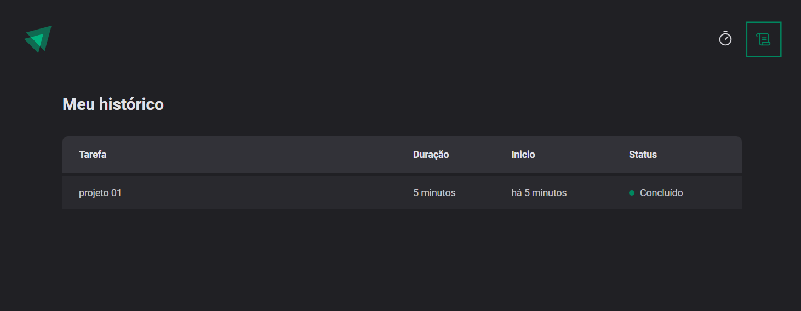
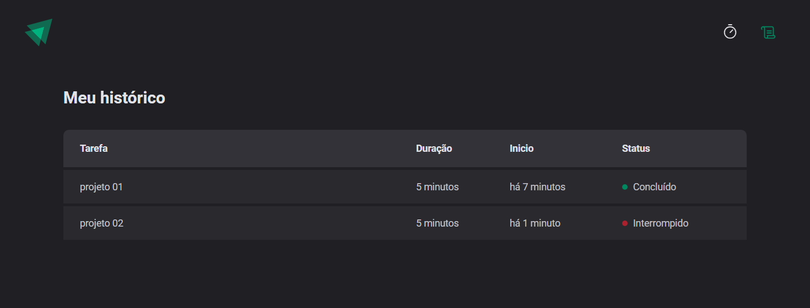

# PROJETO: Desenvolver um timer com estilo pomodoroe que guarda as informações das tarfeas:
* Se concluida;

* Se ainda estiver em andamento;

* Se interrompida;

> Trilha Ignite Projeto feito ao longo das aulas do segundo modulo do Ignite da Rocket:rocket:.

## :hammer_and_wrench: Tecnologias

- ReactJS
- Typescript
- Date-fns
- Hooks do React
- Immer (biblioteca usapa para trabalhar com imutabilidade de elementos)
- Localstorage
- zod
- vite
- Git e Github

## :nut_and_bolt: Neste projeto aprendi

- Criar projeto em Reactjs
- Trabalhar com formulários em React
- Styled-components
- Temas Globais do projeto.
- Layouts
- Componentização.
- Muito sobre Hooks do react:
1. UseState
2. UseEffect
3. Reducers
- Typescript
- Immer (Imutabilidade de elementos)
- Context

## :mailbox_closed: Contatos

> Email - rosendc30@gmail.com

> Linkedin - https://www.linkedin.com/in/francisco-rosendo-a05623241/# rocketnews# ignite-timer
