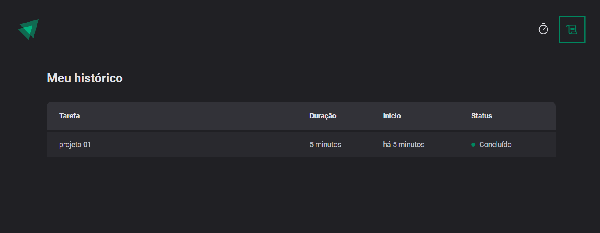
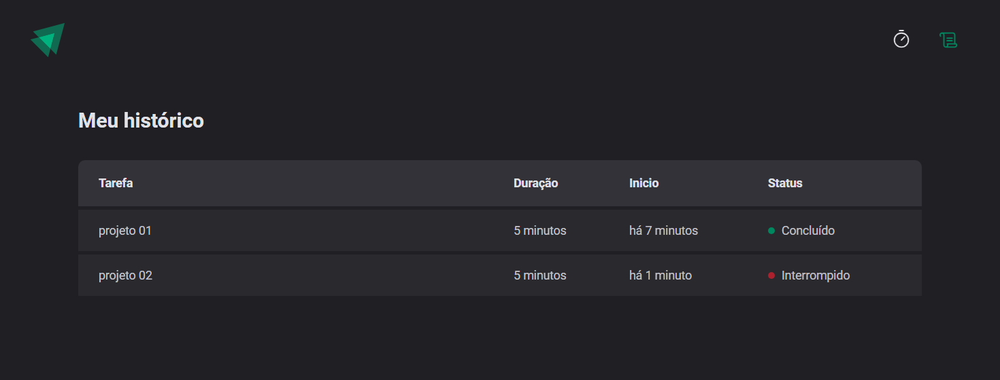

# PROJETO: Desenvolver um timer com estilo pomodoroe que guarda as informações das tarfeas:
* Se concluida;

* Se ainda estiver em andamento;

* Se interrompida;


> Trilha Ignite Projeto feito ao longo das aulas do segundo modulo do Ignite da Rocket:rocket:.

## :hammer_and_wrench: Tecnologias

- ReactJS
- Typescript
- Date-fns
- Hooks do React
- use Hook Form
- Immer (biblioteca usapa para trabalhar com imutabilidade de elementos)
- Localstorage
- zod
- vite
- Git e Github


## :nut_and_bolt: Neste projeto aprendi

- Criar projeto em Reactjs
- Trabalhar com formulários em React
- Styled-components
- Temas Globais do projeto.
- Layouts
- Componentização.
- Muito sobre Hooks do react:
1. UseState
2. UseEffect
3. Reducers
- Typescript
- Immer (Imutabilidade de elementos)
- Context

## :mailbox_closed: Contatos

> Email - rosendc30@gmail.com

> Linkedin - https://www.linkedin.com/in/francisco-rosendo-a05623241/# rocketnews# ignite-timer
=======
# React + TypeScript + Vite

This template provides a minimal setup to get React working in Vite with HMR and some ESLint rules.

Currently, two official plugins are available:

- [@vitejs/plugin-react](https://github.com/vitejs/vite-plugin-react/blob/main/packages/plugin-react/README.md) uses [Babel](https://babeljs.io/) for Fast Refresh
- [@vitejs/plugin-react-swc](https://github.com/vitejs/vite-plugin-react-swc) uses [SWC](https://swc.rs/) for Fast Refresh

## Expanding the ESLint configuration

If you are developing a production application, we recommend updating the configuration to enable type aware lint rules:

- Configure the top-level `parserOptions` property like this:

```js
export default {
  // other rules...
  parserOptions: {
    ecmaVersion: 'latest',
    sourceType: 'module',
    project: ['./tsconfig.json', './tsconfig.node.json'],
    tsconfigRootDir: __dirname,
  },
}
```

- Replace `plugin:@typescript-eslint/recommended` to `plugin:@typescript-eslint/recommended-type-checked` or `plugin:@typescript-eslint/strict-type-checked`
- Optionally add `plugin:@typescript-eslint/stylistic-type-checked`
- Install [eslint-plugin-react](https://github.com/jsx-eslint/eslint-plugin-react) and add `plugin:react/recommended` & `plugin:react/jsx-runtime` to the `extends` list
>>>>>>> cab3fe8ba41302f5e5e154d35b44ca177a6ee8a0
